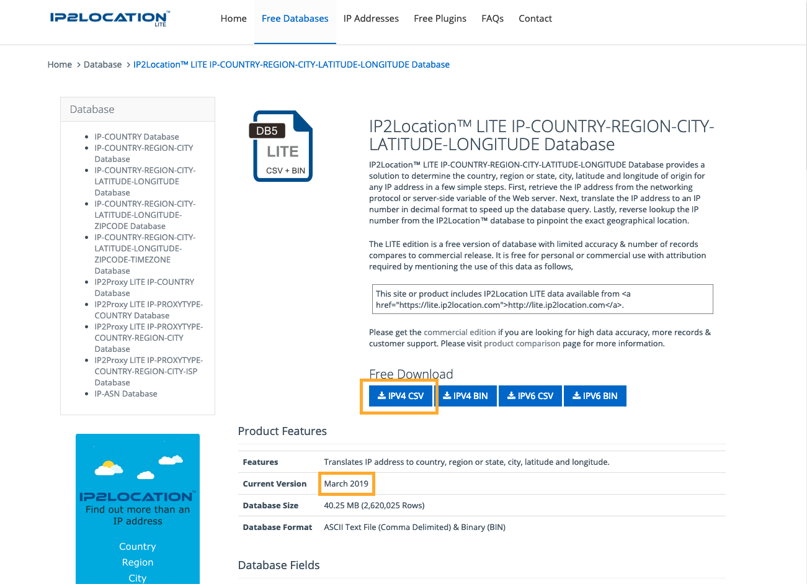

# IP2LOC

A tiny web server for ipv4 to geo location conversion

## System Prerequisites

- [SQLite](https://www.sqlite.org/index.html) is available 
(SQLite is included by default in [these systems](https://en.wikipedia.org/wiki/SQLite#Operating_systems).)
- Only Python3 supported, `>= 3.6` is preferred.

## Quick Start

### Installation & Run

```bash
pip install --user ip2loc-server
ip2loc
```

Now you have already started the server. 
Try

```bash
curl localhost:8080/ip2loc?ip=216.58.221.228
# {"ip": "216.58.221.228", "country_code": "NL", "country_name": "Netherlands", "region_name": "Noord-Holland", "city_name": "Amsterdam", "latitude": 52.37403, "longitude": 4.88969}
curl localhost:8080/url2loc?url=www.google.com
# {"ip": "216.58.221.228", "country_code": "NL", "country_name": "Netherlands", "region_name": "Noord-Holland", "city_name": "Amsterdam", "latitude": 52.37403, "longitude": 4.88969}
curl localhost:8080/url2loc?url=https://www.google.com
# {"ip": "216.58.221.228", "country_code": "NL", "country_name": "Netherlands", "region_name": "Noord-Holland", "city_name": "Amsterdam", "latitude": 52.37403, "longitude": 4.88969}
```

to test the server is working well. Run `ip2loc -h` for more helps.

### Server Port

By default the server listens to port `8080`, you could ONLY modify this in the configure file.
(Arguments specified listening ports are not supported)

In addition multiple ports could be configured as

```python
# multiple listening port example
PORTS = (8080, 8081, 8082,)
```

### Paths

I deliberately do not list the data, configure and log paths in this README file,
for the reason that the default paths are all relative paths which are not easy to be described clearly.

To find these useful path info, run

```bash
ip2loc --showpath
```

## Track the Latest Data

All the data used in this project is from 
[https://lite.ip2location.com/database/ip-country-region-city-latitude-longitude](https://lite.ip2location.com/database/ip-country-region-city-latitude-longitude).

For the reason that the data on this site are updated monthly, you need track the latest data manually.

- Download "IPV4CSV" and remember the current version of data


- Run `ip2loc --loaddata --dataver="current version" --csv="CSV/DATA/PATH/NAME.CSV"` or `ip2loc --loaddata --dataver="current version" --zip="ZIP/DATA/PATH/NAME.ZIP"`


## How This Works

Briefly: Binary search of ordered ip data

See [https://lite.ip2location.com/database/ip-country-region-city-latitude-longitude](https://lite.ip2location.com/database/ip-country-region-city-latitude-longitude) 
for details of data structure.

## Contact Me

[zhenninglang@163.com](zhenninglang@163.com)
